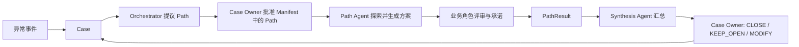
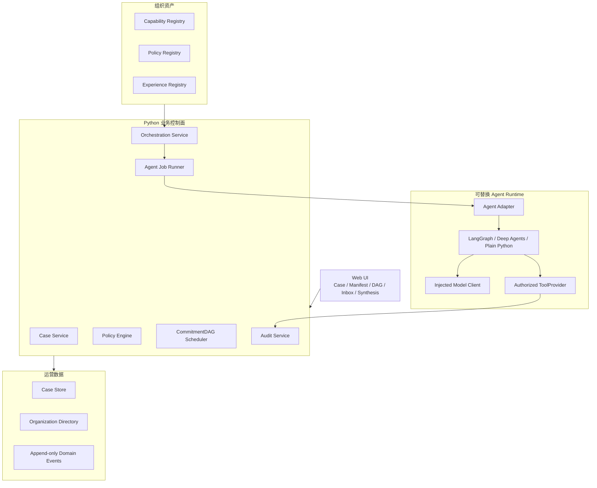

# 产品目标、术语与系统架构

## 1. 产品定位

本项目是一个供应链异常协同平台 demo。第一观众是供应链领导和业务负责人，平台架构师与 Agent 开发者是第二观众。

首版只完整演示一个订单延期 Case，以及其中的“物料替代”解决路径。它需要证明：

1. Case 能够承载跨天、跨角色的业务事实和处置状态；
2. Orchestrator 能够结合组织资产生成可审查的 Path Manifest；
3. 多个业务角色能够在明确的依赖关系下提供证据、评审和承诺；
4. Path Agent 能够根据反馈生成版本化方案并进行 sandbox 推演；
5. 平台可以通过并行评审和局部重审减少不必要的往返；
6. Case Owner 能够基于完整证据关闭 Case 或将其置为 Pending；
7. 所有关键输入、方案版本、承诺和决定均可追溯。

对外推荐表述：

> 一个支持多路径、多 Agent 并行扩展的 Case 协同平台；首个 demo 使用单 Path 验证完整治理闭环。

首版不宣称实现 Agent 群体涌现，也不宣称已经减少真实业务中的审批人数或处理时长。

## 2. 治理原则

平台必须始终遵守以下主线：

约束如下：

- Agent 可以分析、检索、推演、生成方案、申请评审和提出变更建议；
- Agent 不能伪造人的承诺，不能绕过强制 Policy，也不能修改真实业务系统；
- 人的审批针对明确的职责范围，不代表对整个方案承担无限责任；
- Agent run 成功不代表 Case 已解决；
- 最终决定必须回写 Case；
- Case 是业务事实源，Agent 框架的 checkpoint 不是业务事实源；
- 首版的“执行”只指 Path 探索和 sandbox 推演，不包含 ERP、库存、订单或 CRM 变更。

## 3. 统一术语

| 术语 | 定义 | 不是什么 |
|---|---|---|
| Case | 有独立业务结果、Owner 和生命周期的异常工作项 | 普通审批步骤或 Agent task |
| Case Graph | Case 之间的依赖和派生关系图 | 单个 Case 内的执行图 |
| HumanProposal | Case Owner 在创建或受理 Case 时提出的版本化初始解决建议，可为空 | 其他角色的证据、评审或可覆盖的普通文本字段 |
| PathDefinition | 某个 `case_type` 的 Path Catalog 所声明的一种业务解决思路，例如订单延期下的物料替代 | 一次具体 Agent run，或所有 Case 共用的全局枚举 |
| PathAttempt | 某个 PathDefinition 在当前 Case 中的一次探索实例 | 可被原地覆盖的执行记录 |
| Manifest | 本轮 Path 决策及其系统执行细节的版本化载体 | Agent 生成后不可审查的计划书 |
| Decision Layer | Manifest 中供 Case Owner 审查和批准的 Path 层 | 对每个 Tool 的技术审批 |
| Execution Layer | Manifest 中供平台运行的能力、Policy、依赖和证据细节 | 声称由 Owner 逐项批准的内容 |
| CommitmentDAG | 跨角色证据、评审、承诺和 Owner 决定的有向无环依赖图 | 通用 Agent workflow 或聊天记录 |
| Commitment | 具体 Actor 在明确 Claim 范围内作出的责任承诺 | 对整个方案的无限背书 |
| SolutionRevision | Path Agent 生成的不可变方案版本 | 可直接覆盖的当前答案 |
| PathResult | PathAttempt 的终态结果和证据包 | Case 的最终决定 |
| CaseSynthesis | 对全部终态 PathResult 的决策简报 | 未探索新方案的生成器 |
| CapabilityBundle | 面向业务任务组合 Skill 与 Tool 的能力包 | 审批流程 |
| Skill | Agent 完成认知任务时使用的方法和约束 | 跨角色持久化流程 |
| Tool | 有明确输入输出 schema 的可调用能力 | 任意隐藏函数 |
| Experience | 有来源和适用范围的历史观察、反馈或案例经验 | 当前 Case 事实或强制规则 |
| Policy | 决定强制约束、责任和审批要求的结构化规则 | 可漏召回的相似文档 |
| Coordinator | 推动、提醒、转达、升级和标记阻塞的“大调度”角色 | 其他角色的代理审批人 |

## 4. 系统边界

### 4.1 Python 模块化单体

首版采用单进程、单数据库的模块化单体，建议模块边界为：

- `case`
- `manifest`
- `orchestration`
- `policy`
- `experience`
- `capability`
- `commitment`
- `agent_runtime`
- `audit`

领域层不依赖 Web 框架、ORM、LangGraph 或 Deep Agents。API 层负责 DTO 转换，Repository 隔离持久化，Adapter 层负责不同 Agent 框架之间的转换。

### 4.2 数据与审计

首版采用关系型当前状态表与 append-only `domain_events` 审计表：

- 状态变更与事件追加必须处于同一事务；
- 不要求通过事件重放恢复全部状态；
- 本地数据库可以使用 SQLite；
- Case、Manifest、SolutionRevision、Commitment 和 OwnerDecision 都保留显式版本或引用；
- 审计记录不保存模型隐藏思维过程或 API Key。

### 4.3 Agent 运行

- 平台使用自己的确定性状态机和 CommitmentDAG 调度，不使用 Agent 框架承载业务控制面；
- 首版使用进程内异步 Job Runner，不引入消息队列或独立 Worker；
- DB 保存 AgentRun 状态；进程重启后，未完成 run 可以被标记为可重试；
- Agent Adapter 通过配置注册 Python factory；
- Deterministic Adapter 是验收基线，Live Model Adapter 是可选运行模式。

## 5. 三类组织资产

### 5.1 Capability Registry

首版包含：

- `CapabilityBundle`：面向业务任务的高层能力组合；
- `Skill`：Agent 内部的认知方法；
- `Tool`：结构化可调用能力。

不保留 Workflow 一级概念。跨角色、可等待、可恢复、需审计的过程统一由 CommitmentDAG 表达。

Manifest 生成时冻结 Orchestrator 选择的 Skill 入口、平台展开的 Bundle 成员和 Policy 引用；Path 运行时由 Adapter 只解析已批准 Manifest 中的 Skill/Tool，并记录实际版本与调用。Skill 维护 Role 只用于组织资产展示，不进入选择或执行。

### 5.2 Policy Registry

Policy 不能仅靠相似度检索决定是否适用。处理分为：

1. 根据 Case 类型、Path 类型、组织、风险等级等结构化条件匹配；
2. 编译为最低责任要求、强制约束、证据要求和审批限制；
3. Orchestrator 在约束内生成最小 CommitmentDAG。

Policy 包含适用范围、发布组织、权威等级、版本、生效时间、优先级、覆盖权限和冲突策略。无法解决的冲突必须 fail closed，不能让 LLM 猜测。

### 5.3 Experience Registry

Experience 是建议性证据，不能替代当前 Case 的事实或角色确认。可包含：

- Observation
- Feedback
- Episode
- DistilledMemory

每条 Experience 应保留来源、时间、适用范围和置信信息。Case 结束后，Agent 只能生成 `MemoryCandidate`；候选经治理后才能成为后续可检索 Experience。首版只展示固定 Experience 和一条待审核候选。

## 6. Manifest 语义

Manifest 是版本化对象，不允许批准后原地修改。

Decision Layer 至少包含：

- 候选 Path；
- Orchestrator 推荐理由；
- 主要风险和预期结果；
- 关键责任角色；
- Path 的 selected、removed 状态。

Execution Layer 至少包含：

- PathAttempt 计划；
- CapabilityBundle；
- 编译后的 Policy 约束；
- CommitmentDAG；
- Evidence 要求；
- Experience 引用；
- Case、HumanProposal 和资产版本快照；
- `max_revision_rounds` 等运行配置。

Owner 的批准范围明确为“批准执行 Decision Layer 中保留的所有 Path”，不声称 Owner 审查了每个 Skill 或 Tool。

调整规则：

- 批准前可以直接删除 Path；
- 批准后、运行前删除 Path 会生成新的 Decision Layer 版本，不要求 Orchestrator 重做剩余 Path；
- 运行中停止 Path 使用 `CANCELLED`，不删除历史；
- 等价能力替换、重试和非侵入式证据采集不要求 Owner 重批；
- 改变 Path 目标、成功标准、业务风险、责任角色或强制 Policy 时，必须重新批准 Path。

## 7. 明确非目标

首版不包含：

- 真实 ERP、库存、订单、CRM 或客户系统集成；
- 通用可视化 DAG 编辑器；
- 完整 Policy DSL 编辑器；
- 自动发布新 Skill、Tool、Policy 或 Experience；
- 自由涌现的新 Path；
- 多租户和生产级身份权限；
- Agent 框架 checkpoint 互相迁移；
- 生产级通知、消息队列、高可用或灾难恢复；
- 通过自动审批减少强制责任角色；
- 真实业务节省时间或审批人数的量化结论。
