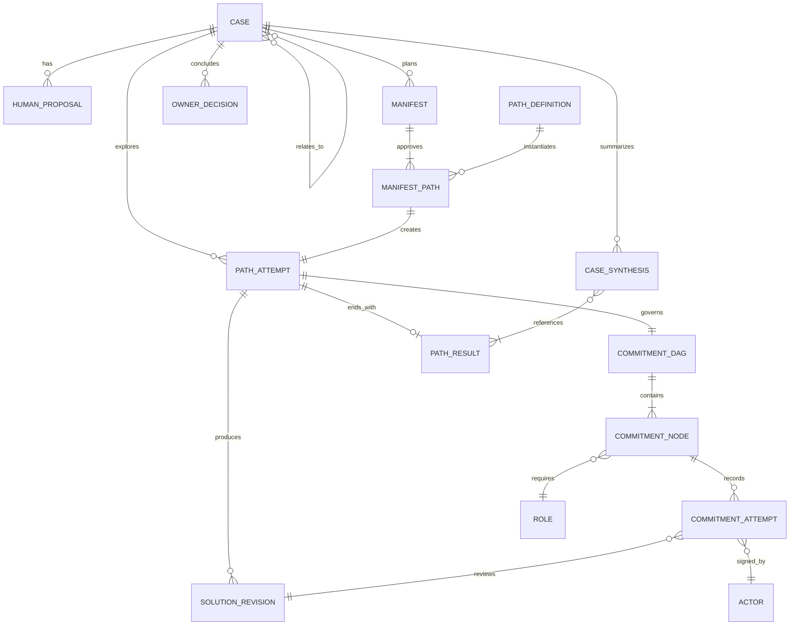
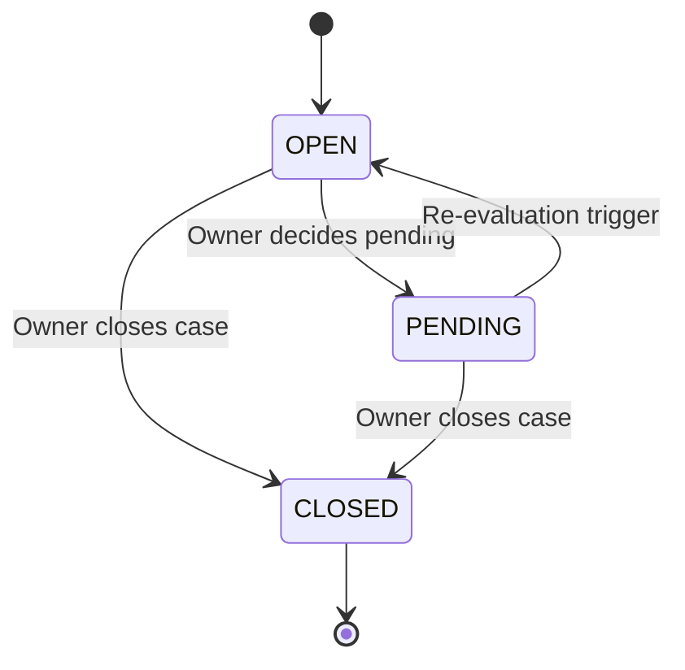
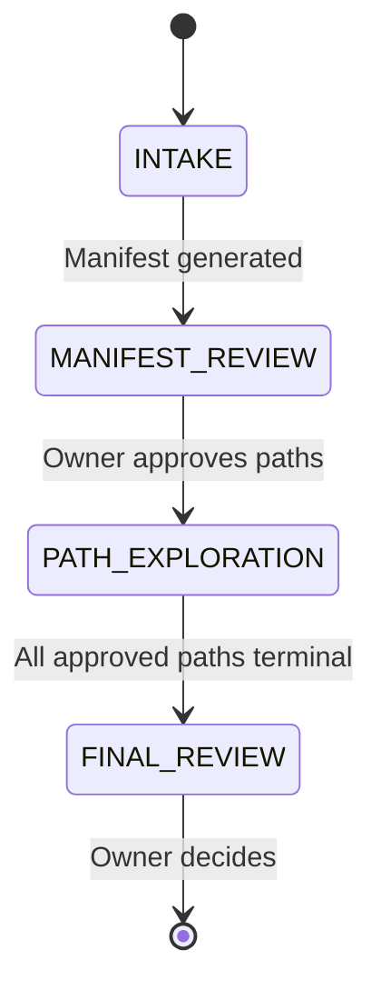
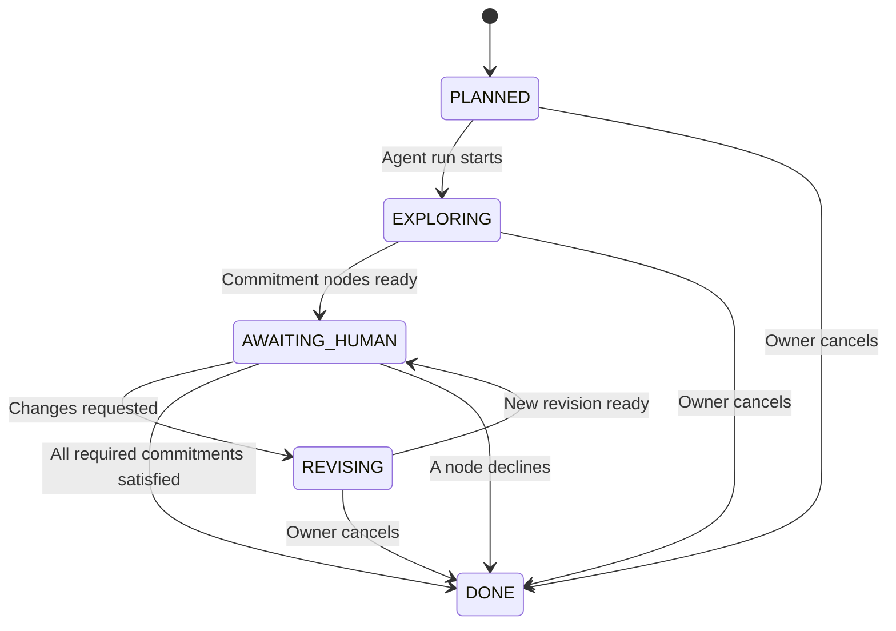

# 领域模型、状态机与 CommitmentDAG

## 1. 领域关系

## 2. 核心对象

### 2.1 Case

建议字段：

- `id`
- `case_type`
- `title`
- `description`
- `business_payload`
- `status`
- `orchestration_phase`
- `owner_role_id`
- `current_owner_actor_id`
- `ownership_history`
- `created_at` / `updated_at`
- `version`

一个工作项只有同时具有独立业务结果、Owner 和生命周期时，才应成为 Case。普通调查、审批和沟通属于 Case 内部节点。Agent 发现新的独立异常时，只能提出派生 Case 建议；经人确认后才能创建并写入 Case Graph。

Case Graph 支持的首版关系：

- `derived-from`
- `depends-on`
- `blocked-by`
- `related-to`

### 2.2 HumanProposal

HumanProposal 可为空，但一旦提交必须版本化。建议字段：

- `case_id`
- `revision`
- `author_actor_id`
- `content`
- `created_at`

Manifest 记录采用、部分采用或未采用的 HumanProposal 版本及理由。

### 2.3 PathDefinition 与 PathAttempt

`PathDefinition` 表达组织已知解决思路，例如 `MaterialSubstitution`。它可以包含：

- 目标；
- 适用条件；
- 默认 CapabilityBundle；
- 默认 CommitmentDAG 模板；
- 成功证据定义。

`PathAttempt` 是某个定义在具体 Case 中的一次探索。相同 PathDefinition 可以再次尝试，但必须创建新的 PathAttempt，不能覆盖前次失败记录。

### 2.4 SolutionRevision

首版方案固定为以下 Section：

- `supply`
- `technical`
- `customer`
- `overall_recommendation`

每个 Section 保存稳定 ID、内容和内容哈希。SolutionRevision 不可变；修改产生新版本，并记录与前一版本的 Section diff。

建议附带的结构化信息：

- 方案正文；
- Claims；
- Evidence 引用；
- 假设与风险；
- 面向 Commitment 节点的材料包。

首版审批人不需要手工填写复杂的假设、失效条件或补救问卷。

## 3. Case 状态

Case 的业务状态与系统编排阶段必须分离。

### 3.1 Case status

- `OPEN`：正在处理或等待当前编排；
- `PENDING`：业务决定暂不关闭，等待明确条件或日期；
- `CLOSED`：Owner 已作关闭决定。

### 3.2 Orchestration phase

- `INTAKE`
- `MANIFEST_REVIEW`
- `PATH_EXPLORATION`
- `FINAL_REVIEW`

`PENDING` 不等于等待某次审批；等待审批属于 Path 和 Commitment 层。

## 4. PathAttempt 生命周期

PathAttempt 的 phase 与 outcome 分离。

Phase：

- `PLANNED`
- `EXPLORING`
- `AWAITING_HUMAN`
- `REVISING`
- `DONE`

Outcome：

- 空值：尚未结束；
- `SUCCEEDED`：产生满足强制承诺要求的方案；
- `FAILED`：专业角色明确 DECLINE，证明本次 PathAttempt 不可行；
- `CANCELLED`：Case Owner 主动终止。

阻塞信息存放在 `active_blockers[]`，不将 `BLOCKED` 设为终态。阻塞解除后恢复原 phase。无法解决的阻塞必须升级给 Coordinator 和 Owner，由 Owner 继续等待或取消 Path；系统不能自动伪装为失败。

所有当前获批 PathAttempt 达到终态后，才允许生成 CaseSynthesis。

## 5. CommitmentDAG

### 5.1 节点类型

前端可以统一称为“审批 DAG”或“审批链”，内部对象使用 `CommitmentDAG`。节点类型为：

- `EVIDENCE`：提供事实或证据；
- `REVIEW`：作出专业判断并提出修改意见；
- `APPROVAL`：对明确 Claim 作出承诺；
- `OWNER_DECISION`：Case Owner 的最终决定。

DAG 边只表示就绪依赖：上游达到指定结果并提供所需 Artifact 后，下游才可开始。下游不需要对上游人员本身作出审批。

DAG 描述稳定的责任拓扑，不用反向边表达打回循环。打回通过新的 SolutionRevision 与 CommitmentAttempt 记录。

### 5.2 角色解析

节点首先要求 `Organization + Role`，就绪后进入角色 Inbox，由具体 Actor 认领。审批记录保存 Actor 在提交时拥有的角色。改派和委托必须留痕。

首版可为每个角色固定一个 Actor，但仍使用认领语义。Role Switcher 必须标记为 `Demo identity simulation`，不得声称提供生产级认证授权。

Coordinator 可以查看、提醒、升级、转达、标记阻塞和建议改派，但不能代替业务角色 COMMIT，除非该 Actor 同时拥有相应角色。

### 5.3 最小审批结果

首版只支持：

- `COMMIT`
- `REQUEST_CHANGES`
- `DECLINE`

平台自动保存 Actor、角色、时间、SolutionRevision、Claim 与当时展示的证据。`COMMIT` 可以不填写说明；`REQUEST_CHANGES` 和 `DECLINE` 必须填写简短原因。

- `REQUEST_CHANGES` 触发 Agent 生成新 SolutionRevision；
- `DECLINE` 使当前 PathAttempt 进入 `DONE + FAILED`；
- 缺少信息时首版使用 `REQUEST_CHANGES`，暂不引入 `REQUEST_INFORMATION`。

### 5.4 并行审批与最小责任 DAG

Policy 声明最低责任要求，Orchestrator 在约束内解析最少的具体角色节点：

- 同一 Actor 若同时拥有两个有效角色，可以在一次交互中分别签署两个 Commitment；
- 没有就绪依赖的节点默认并行；
- Agent 可以提出减少重复节点或改变 DAG 的建议；
- 强制 Policy 节点不能被 Agent 删除；
- 节点不适用、证据已覆盖或责任完全重复时，删减建议必须附带可审查依据。

首版主要证明并行评审和局部重审，不以减少责任角色数量为主要卖点。

## 6. 局部重审

每个 Commitment 节点声明自己审查的 Solution Section。生成新 SolutionRevision 后，平台比较 Section 哈希：

1. 审查发生变化 Section 的节点变为 `STALE`；
2. 依赖这些节点的下游 Commitment 也变为 `STALE`；
3. 无关并行分支的 `COMMIT` 继续有效；
4. 只重新打开 `STALE` 节点。

Agent 可以建议影响范围，但最终失效计算由平台完成。

Golden Path 中，上游承诺一开始覆盖候选物料 A 和 B。客户拒绝 A、选择 B 时，`supply` 和 `technical` Section 未变化，仅 `customer` 和 `overall_recommendation` 变化，因此主计划与研发 Commitment 仍然有效。

如果 Agent 引入未被上游评审的物料 C，则 `supply` 和 `technical` 必须变化并触发相应重审。

`max_revision_rounds` 为可配置项，优先级为 Path/Policy override 高于平台默认值，并在 Manifest 生成时冻结。达到上限后，Path 保持 `AWAITING_HUMAN`，并增加 `revision_limit_reached` blocker；Owner 可以留痕追加一轮或取消 Path，不自动判定失败。

## 7. OwnerDecision

Owner 首版只选择：

- `CLOSE`
- `PENDING`

平台自动将当前 CaseSynthesis、所有 PathResult、SolutionRevision 和有效 Commitments 的快照附加到 OwnerDecision。

CaseSynthesis 本身也必须版本化。重新汇总会创建新版本，OwnerDecision 引用作出决定时看到的具体版本。

关闭不触发外部业务系统修改。Pending 记录当前快照，并允许未来由重新评估条件或人工操作恢复到 OPEN。
