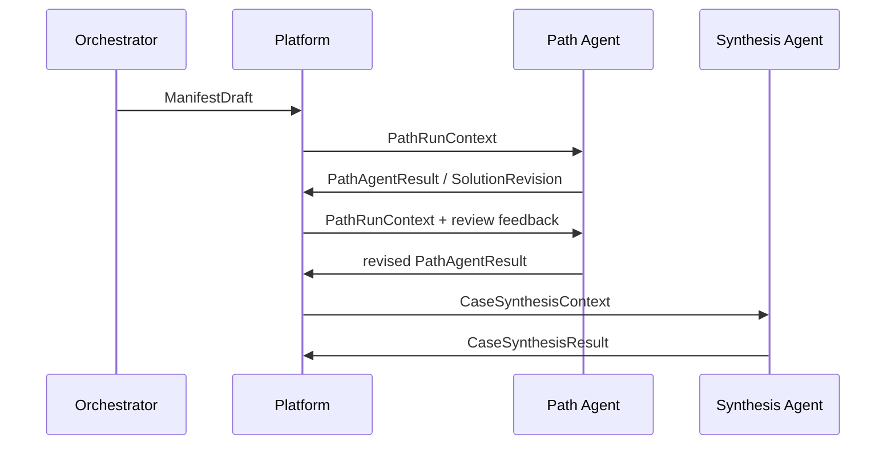

# Agent Adapter 契约

## 1. 目标

平台允许用户选择 LangGraph、Deep Agents、普通 Python Agent 或其他框架，并注入自己的模型客户端。平台核心不直接依赖任何具体 Agent 框架，也不承诺框架之间迁移私有 checkpoint。

最小保证是：

- 核心代码不 import 特定 Agent 框架；
- 不同 Adapter 接收统一的平台上下文；
- 不同 Adapter 返回可验证的结构化 Artifact；
- 替换 Adapter 后可以从平台保存的最新业务 Artifact 重新启动；
- Agent 私有状态不成为 Case 的权威状态。

## 2. Agent 类型与职责

### 2.1 Orchestrator

负责：

- 理解 Case 与 HumanProposal；
- 对命中 orchestration Skill 声明的全部 Path 生成 Case-specific 解释和相关性排序；
- 检索相关 Experience；
- 在编译后的 Policy 约束下生成 Manifest 草案。

不负责：

- 提前生成具体替代物料方案；
- 决定是否忽略强制 Policy；
- 替人作出 Commitment；
- 直接创建生效的新能力、Policy 或 Experience。

Path 声明、execution Skill 与 Policy 匹配、权限检查、角色资格、DAG 校验和版本固定由确定性平台组件处理。LLM 负责理解、排序与解释，不能省略或发明 Path，也不能决定 CapabilityBundle。

### 2.2 Path Agent

每个 PathAttempt 对应一个逻辑 Path Agent。它可以被多次调用，以完成：

- 生成方案初稿；
- sandbox 推演；
- 整理 Commitment 材料包；
- 接收 REQUEST_CHANGES；
- 生成新的 SolutionRevision；
- 说明改动内容与建议影响范围。

它不能直接改变 Case、Manifest、Commitment 或 PathAttempt 状态。

### 2.3 Synthesis Agent

负责：

- 检查终态 PathResult 是否完整；
- 汇总成功证据、失败原因和取消理由；
- 列出有效 Commitments 和残余风险；
- 生成 Case Owner 的决策简报。

它不能补写未探索方案。可以建议开启新一轮 Orchestration，但不能把新建议伪装成已验证 PathResult。

单 Path demo 中，它只做完整性检查与决策简报，不假装执行多方案比较。

## 3. 协作方式

Agent 之间不直接私聊，必须通过平台保存的版本化 Artifact 协作：



聊天历史、框架内部 memory 和 checkpoint 不能替代上述 Artifact。

## 4. 调用模型

> 本节描述的是目标契约，**不是当前实现**。当前三个 Agent 使用更窄的接口
> （Planner 为 `propose(context, candidates, trace)`，Path 与 Synthesis 为
> `generate(context, trace)`），且 ToolProvider 与 event_sink 尚未作为独立参数
> 注入。已实现范围见 [§13](#13-当前已实现的-orchestrator-切片)。

概念性最小接口：

```python
run(context, tool_provider, event_sink) -> AgentResult
```

实现要求：

- 调用是异步的；
- 每次初稿生成或修订都是一次独立 run；
- Adapter 可以返回私有 `checkpoint_ref`；
- 平台不依赖 checkpoint 才能继续业务流程；
- 暂停、恢复、运行中跨框架迁移不属于首版标准能力。

任务类型与返回 schema 至少包括：

- `ORCHESTRATION -> ManifestDraftResult`
- `PATH_RESOLUTION -> PathAgentResult`
- `CASE_SYNTHESIS -> CaseSynthesisResult`

三个任务可以由同一 Adapter family 实现，但职责和 schema 必须分开。

### 4.1 运行审计上下文与模型上下文分离

当前 OpenAI-compatible Adapter 不再把完整运行审计对象直接序列化给模型。平台先保留可复核的 `PlanningContext + PlanningCandidate[]`、`PathAgentContext` 或 `SynthesisContext`，再在调用边界投影为专用 Prompt DTO：

- `PlannerPromptContext` 只包含 Case、Path 的 `definition/title/description`，以及跨候选去重后的编排 Skill 指令；Policy、Knowledge 和 Commitment ID 仍留在能力解析 trace 与 Manifest 快照中。
- `PathPromptContext` 只包含当前 Case/Path、精简的执行 Skill 指令、建议性 Knowledge、授权选项、已经执行的只读 Tool 结果、角色报告契约和上一版方案；不向模型重复发送完整 Policy、compiled policy、CommitmentDAG、Skill 文件清单、Tool 全量 records 或重复 option ID 列表。
- `SynthesisPromptContext` 只包含汇总所需的 SolutionRevision 字段、精简 Commitment 状态和授权引用；生成来源、Manifest 回链及平台内部依赖字段仍保存在权威 Artifact 中。

Prompt 投影只减少模型输入，不改变 Manifest 冻结内容、AgentRun 审计、平台语义校验或失败无副作用保证。自定义 Adapter 仍消费稳定的完整运行上下文，因此可以自行实现等价或更严格的模型投影。

## 5. PathRunContext

平台必须传入冻结、最小授权的上下文，而不是允许 Adapter 任意查询数据库。建议包含：

- `case_snapshot`
- `human_proposal_ref`
- `manifest_ref`
- `path_definition`
- `path_attempt_snapshot`
- `commitment_dag_snapshot`
- `capability_bundle_refs`
- `compiled_policy_constraints`
- `experience_excerpts`
- `previous_solution_revision`
- `review_feedback`
- `sandbox_descriptor`
- `authorized_tool_descriptors`
- `run_config`

所有引用包含必要的 ID 和版本。Experience 摘要保留来源；Policy 传递编译后的强制约束与必要解释，不能只塞入一批相似文本。

Adapter 不得通过自己的模型或 Tool 绕开上下文权限范围。

## 6. PathAgentResult

当前最小实现已经落地：`backend/agentic_cm/path_agent.py` 从已批准 Path 的冻结 Manifest 快照组装 `PathAgentContext`，OpenAI-compatible Adapter 通过官方 `openai-python` SDK 请求 `PathAgentResult/v1`，由 Pydantic 生成并解析结构 Schema；平台继续负责 option 引用、角色报告和 Manifest 授权范围等业务校验，全部通过后才持久化 `SolutionRevision`。模型请求失败或输出非法时只保留 `agent_type=path` 的审计 trace，不改变 Case、PathAttempt、Commitment 或业务事件。

首版稳定外层字段为：`summary`、`options[]`、`recommendation`、`evidence_gaps`、`role_reports[]`。平台只补入 revision 和 adapter profile；Path、Manifest 与强制 Commitment 关系由父级对象和冻结快照提供，不在 SolutionRevision 重复保存。候选与只读模拟 Tool 来自冻结 Skill；角色报告契约来自冻结 Policy Commitments。框架按每条 Path 实际命中的 Policy 执行角色/维度、统一的 `{role}维度：` 句首和完整句校验，不复制 A/B 或固定角色的领域判断。

建议结构：

- `solution_sections`
  - `supply`
  - `technical`
  - `customer`
  - `overall_recommendation`
- `claims`
- `evidence_refs`
- `assumptions`
- `risks`
- `commitment_packages`
- `unresolved_questions`
- `dag_change_proposals`
- `suggested_impact_scope`
- `summary`
- `checkpoint_ref`，可选

自然语言可以存在于字段内，但外层 schema 必须稳定。平台只在整个结果通过 schema 和领域校验后创建 SolutionRevision。

Agent 提供的影响范围只是建议；平台根据 Section 哈希、节点审查范围和 DAG 依赖计算实际失效范围。

## 7. CaseSynthesisResult

当前最小实现位于 `backend/agentic_cm/synthesis_agent.py`。只有所有已选 PathAttempt 均进入 `SUCCEEDED` 或 `REJECTED` 后，Case 才能生成报告；成功与失败 Path 必须各自出现一次。报告与 `agent_type=synthesis` 的逐步 trace 仅 Case Owner 可见，失败运行不改变 CaseSynthesis。

建议结构：

- `case_snapshot_ref`
- `path_summaries`
- `successful_paths`
- `failed_paths`
- `cancelled_paths`
- `valid_commitments`
- `remaining_risks`
- `recommended_owner_action`
- `decision_brief`

所有结论必须引用已有 PathResult、SolutionRevision 或 Commitment。Synthesis Agent 不得创建新的业务证据。

## 8. ToolProvider

Adapter 可以将平台 Tool 转换成框架原生 Tool，但 Tool 必须来自授权的 ToolProvider。

ToolDescriptor 至少包含：

- 稳定 ID 与版本；
- 输入输出 schema；
- 权限范围；
- sandbox 限制；
- 是否只读；
- 审计标签。

首版 Tool 只访问固定 demo 数据和 Agent sandbox。所有调用记录 Tool、版本、输入摘要、输出摘要、调用者、PathAttempt 和 AgentRun。

不得记录 API Key、完整敏感凭证或模型隐藏思维过程。

## 9. 模型注入与 Adapter 注册

Adapter factory 接收用户配置并自行创建或接收模型客户端。平台核心只保存脱敏的 `model_profile_id`。

概念配置：

```yaml
adapters:
  deterministic:
    factory: demo.adapters.deterministic:create
  live:
    factory: integrations.example:create
```

首版不建设插件市场。动态 factory 必须经过显式配置，不允许从 Case 输入任意加载 Python 路径。

## 10. 事件与可观测性

Adapter 通过 `event_sink` 发送归一化运行事件。Orchestrator、Path 与 Synthesis Adapter 都把事件持久化到独立的 `agent_runs / agent_trace_events` 技术审计表，并复用同一外层契约。归一化事件包括：

- `run_started`
- `status_updated`
- `tool_call_started`
- `tool_call_completed`
- `artifact_proposed`
- `run_completed`
- `run_failed`

不要求标准化不同框架的 token stream 或内部 trace。面向业务的输入、显式输出、判断依据、Evidence 和 SolutionRevision diff 必须保存；API Key 与隐藏 chain-of-thought 不保存。

## 11. 失败处理

Agent 输出不合法时：

1. Adapter 内允许一次结构化修复；
2. 仍不合法则 AgentRun 失败；
3. 不创建 SolutionRevision；
4. 不改变 Commitment 或 Case 状态；
5. Path 保持当前 phase，并记录技术 blocker；
6. 用户可以重试或更换 Adapter。

技术失败不能伪装为业务 DECLINE 或 Path FAILED。

## 12. 契约兼容性

至少提供两个实现并通过同一套 contract tests：

- Deterministic Adapter；
- 一个可注入模型客户端的简单 Adapter。

测试重点是输入隔离、schema 校验、非法输出无副作用、Tool 审计和 Artifact 可追溯，而不是不同框架产生相同自然语言答案。

## 13. 当前已实现的 Orchestrator 切片

当前代码已实现 `DeterministicPlannerAdapter` 与 `OpenAICompatiblePlannerAdapter`。两者消费同一 `PlanningContext + PlanningCandidate[]`，只返回候选 Path ID 与 rationale；OpenAI-compatible 传输与错误映射集中在共享 SDK 封装，Pydantic 负责结构校验，Policy 匹配、Policy 编译、Manifest 冻结、Case 状态推进与事件持久化仍留在平台内核。详见 [Orchestrator 实现](06-orchestrator.md)。

这比概念性的通用 `run(context, tool_provider, event_sink)` 更窄，是 Orchestration 任务的首个可运行子协议。后续若用 LangGraph、Deep Agents 或其他 Runtime，只允许在该 Adapter 内实现这个协议，不得把框架状态提升为 Case 权威状态。
